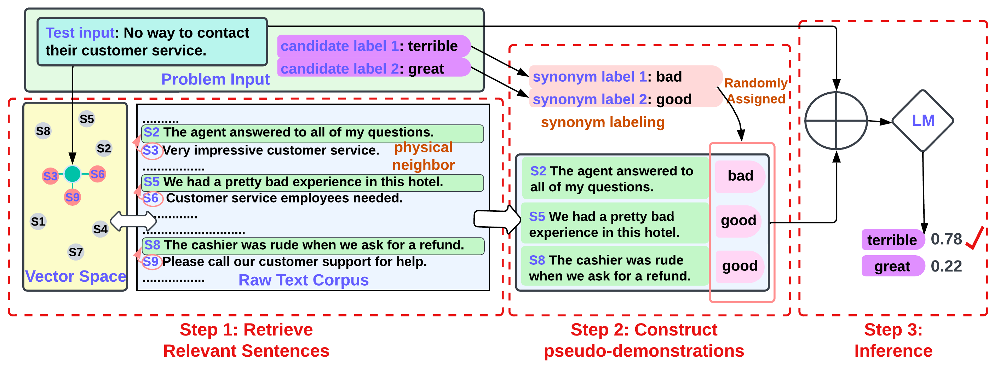

# Z-ICL: Zero-Shot In-Context Learning with Pseudo-Demonstrations

This includes an original implementation of "[Z-ICL: Zero-Shot In-Context Learning with Pseudo-Demonstrations][paper]" by [Xinxi Lyu][xinxi], [Sewon Min][sewon], [Iz Beltagy][iz], [Luke Zettlemoyer][luke], [Hannaneh Hajishirzi][hanna].

<p align="center">
  
</p>

This code provides:
- Codes for running the three steps of Z-ICL as introduced in Section 4.
- Commands to run the models and get numbers reported in main experiment of the paper.

Please leave issues for any questions about the paper or the code.

If you find our code or paper useful, please cite the paper:
```
@inproceedings{ lyu2022zicl,
    title={ Z-ICL: Zero-Shot In-Context Learning with Pseudo-Demonstrations },
    author={ Lyu, Xinxi and Min, Sewon and Beltagy, Iz and Zettlemoyer, Luke and Hajishirzi, Hannaneh },
    journal={ arXiv preprint arXiv:2212.09865 },
  year={ 2022 }
}
```

### Announcements
05/24/2023: Our paper is accepted by ACL 2023. 

## Content
1. [Installation](#installation)
2. [Prepare Corpus](#prepare-corpus)
3. [Prepare Datasets](#prepare-datasets)
3. [Z-ICL](#z-icl) (Section 4 of the paper)
    * [Step 1: Retrieve Relevant Sentences](#step-1-retrieve-relevant-sentences) (Section 4.1 of the paper)
    * [Step 2: Construct Pseudo-demonstrations](#step-2-construct-pseudo-demonstrations) (Section 4.2 of the paper)
    * [Step 3: Inference](#step-3-inference) (Section 4.3 of the paper)
4. [Baselines](#baselines) (Section 5.2 of the paper)
    * [No-demonstrations](#no-demonstrations)
    * [Random inputs](#random-inputs)
    * [Naive Z-ICL](#naive-z-icl)
    * [ICL-gold](#icl-gold)
    * [ICL-random](#icl-random)

## Installation
The code is tested with python 3.8.

Create a new conda environment for this project:
```bash
conda create --name z-icl python=3.8
conda activate z-icl
```

Install the dependencies (`gdown`, `datasets`, `faiss`, `nltk`, `tqdm`, `simcse`, `pytorch`, `transformers`) using the following command:
```bash
bash build_dependencies.sh
```

## Prepare Corpus

We use exactly the same corpus from the [DEMix Layers paper][demix-link]. Unfortunately, we are unable to help you skip getting approvals from the original data hosters. Alternatively, you have two options.

*Option 1*: If it is purely for research purposes, email [us](mailto:alrope@cs.washington.edu), and we will see what resources we can share.

*Option 2*: We publicly release the retrieved sentences from the corpus (the output of Step 1 in Z-ICL). You can download via the following command lines, and you won't need access to the original corpus data. You can then start from Step 2 in Z-ICL.
```bash
gdown 1ksfaWRZloLJa23oDMZMtwilJroaO3yjN
unzip retrieved.zip
mkdir -p datasets
mv retrieved datasets/
```

#### If you want to use a customed corpus
The customed corpus files has to be `.txt` files (e.g. `corpus1.txt`, `corpus2.txt`, ...). Put them into `corpuses` in the root directory, and run the following scripts:
```bash
python preprocess/preprocess_corpus.py --corpus {corpus1,corpus2,...} --n_sentence {number of sentence to sample from each corpus file} # preprocess the raw corpus files(downsizing and breaking them down into single sentences)
python scripts/build_index.py --corpus {corpus1,corpus2,...}  --new_corpus_name {a name to call the combined corpus} # build the embeddings and index of the corpus
```

###
## Prepare Datasets
We use 9 single-sentence classification datasets (`CR`, `Amz`, `Amz5`, `Yelp`, `Yelp5`, `Tweet`, `MR`, `SST2`, `SST5`) as introduced in Section 5.1 of the paper. Download the datasets `Amz`, `Yelp`, and `Tweet` using the following command: 
```
python preprocess/_build_gym.py --build --do_test
```
Then, download the rest of the datasets (`CR`, `Amz5`, `Yelp5`, `MR`, `SST2`, `SST5`) provided by the [Channel LM Prompting paper][channel-link] 
paper:
```bash
gdown 1pHbhWzWJZ7HbEQuvwN3-KkqMLRv2TWJf
unzip data.zip
```
Finally, preprocess the downloaded datasets by running the following command. (This includes creating random label verions of the datasets, downsizing the datasets, etc.)
```bash
python preprocess/modify_dataset.py
```

## Z-ICL

This is for reproducing experiments with our method Z-ICL reported in Section 6.1. 9 evaluation dataset are: `CR`, `Amz`, `Amz5`, `Yelp`, `Yelp5`, `Tweet`, `MR`, `SST2`, `SST5`.

### Step 1: Retrieve Relevant Sentences
We first retrieve sentences that are close to the test inputs from the corpus, which should share similar distribution with the test inputs. Specifically we use **physical neighbor** to avoid retrieving sentences that are too close to the test inputs. See Section 4.1 of the paper for more details.
```bash
python scripts/retrieve.py --dataset {dataset} --method pn
```
Note: If you have downloaded the output of Step 1, then you can skip this part. Just make sure the downloaded, retrieved sentences are placed under `datasets/retrieved`.

Other useful flags:
* `--corpus`: names of the corpus files if using a customed corpus (e.g. `corpus1,corpus2,...`)
* `--test_batch_size`: can be adjusted based on your GPU memory availability for building SimCSE embeddings. 

Note that you can inspect the retrieved sentences under `datasets/retrieved`.


### Step 2: Construct pseudo-demonstrations
In the step, we pair each retrieved sentence with a randomly assigned label to construct pseudo-demonstrations. We propose the method **synonym labeling** to use synonyms of the labels for these pseudo-demonstrations in order to avoid the **copying effect** as described in Section 3 of the paper. See Section 4.2 of the paper for more details.

```bash
python scripts/form_pdemos.py --dataset {dataset} --method pn --synonym_labeling
```

### Step 3: Inference
We finally run standard in-context learning using the constructed pseudo-demonstrations.
See Section 4.3 of the paper for more details.

```bash
python scripts/run_inference.py --dataset {dataset} --model_method {direct|channel} --gpt {gpt-j|gpt-neox} --variant z-icl
```
* `--test_batch_size`: can be adjusted based on your GPU memory availability. 
* `--use_int8`: enable int8 quantization following [Glm-130b repository][int8], allowing running 20B parameter model GPT-NeoX on a 32GB GPU. 

## Baselines

This is for reproducing numbers of the baselines described in Section 5.2 of the paper.

### No-demonstrations
This is the previous zero-shot baseline where the language model is simply conditioned on the test input.
```bash
python scripts/run_inference.py --dataset {dataset} --model_method {direct|channel} --gpt {gpt-j|gpt-neox} --variant no_demos
```

### Random inputs
For this baseline, we simply retrieve random sentences from the corpus without any other techniques.
```bash
python scripts/retrieve.py --dataset {dataset} --method ri # retrieve random sentences, could be skipped if not using corpus
python scripts/form_pdemos.py --dataset {dataset} --method ri # construct pseudo-demonstrations with random sentences
python scripts/run_inference.py --dataset {dataset} --model_method {direct|channel} --gpt {gpt-j|gpt-neox} --variant random_inputs
```

### Naive Z-ICL
We do not use either **physical neighbor** or **synonym labeling**, but instead retrieve the nearest sentences and pair them with random labels from the the original label space for this baseline. 
```bash
python scripts/retrieve.py --dataset {dataset} --method nearest # retrieve random sentences, could be skipped if not using corpus
python scripts/form_pdemos.py --dataset {dataset} --method nearest # construct pseudo-demonstrations with random sentences
python scripts/run_inference.py --dataset {dataset} --model_method {direct|channel} --gpt {gpt-j|gpt-neox} --variant naive_z-icl
```

### ICL-gold
This baseline is the standard in-context learning method that assumes labeled examples are given. Note that it is not comparable to Z-ICL since it is not zero-shot.
```bash
python scripts/run_inference.py --dataset {dataset} --model_method {direct|channel} --gpt {gpt-j|gpt-neox} --variant icl-gold
```

### ICL-random
This baseline is the in-context learning that assumes unlabeled examples are given, and we pair these examples with random labels. Note that it is not comparable to Z-ICL since it is not zero-shot.
```bash
python scripts/run_inference.py --dataset {dataset} --model_method {direct|channel} --gpt {gpt-j|gpt-neox} --variant icl-random
```


[paper]: https://arxiv.org/abs/2212.09865
[sewon]: http://shmsw25.github.io/
[xinxi]: https://alrope123.github.io/
[iz]: https://beltagy.net/
[hanna]: https://homes.cs.washington.edu/~hannaneh/index.html
[luke]: https://www.cs.washington.edu/people/faculty/lsz

[metaicl]: https://github.com/facebookresearch/MetaICL
[int8]: https://github.com/THUDM/GLM-130B
[data-link]: https://drive.google.com/file/d/1pHbhWzWJZ7HbEQuvwN3-KkqMLRv2TWJf/view?usp=sharing
[channel-link]: https://github.com/shmsw25/Channel-LM-Prompting
[demix-link]: https://github.com/kernelmachine/demix
